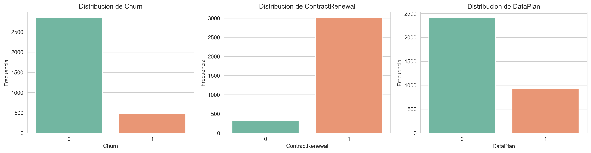
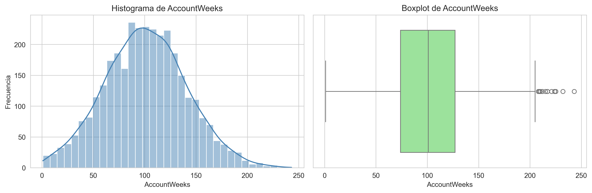
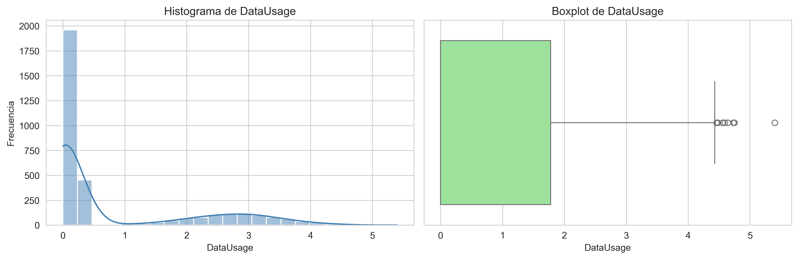
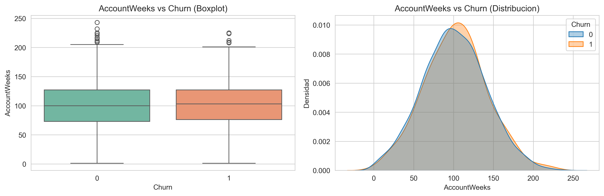

# Telecom Churn Intelligence Dashboard

Proyecto end-to-end de Data Science para portfolio: analisis de churn en telecomunicaciones con API de Machine Learning (FastAPI) y dashboard interactivo (Streamlit).

## TL;DR

- Prediccion de churn con modelos supervisados (Logistic + Decision Tree)
- Dashboard interactivo con simulador conectado a API
- Recall optimizado para deteccion de clientes en riesgo
- Principales drivers: ContractRenewal, CustServCalls, MonthlyCharge

## Dashboard

### Recorrido visual (storytelling)

1. Nivel de problema: el churn existe y tiene escala para negocio.



2. Senal de precio/valor: los clientes que churnean muestran diferencias en gasto y consumo.



3. Senal de friccion operacional: mas contacto con soporte tiende a coexistir con mayor riesgo.



4. Lectura integral: la matriz de correlacion permite priorizar variables para modelado.



## 1. Problema de negocio

La fuga de clientes (churn) es uno de los principales problemas de rentabilidad en telecomunicaciones.

- Consecuencia directa: perder clientes reduce ingresos recurrentes y obliga a invertir mas en adquisicion.
- Impacto operativo: aumenta la presion sobre soporte, marketing y ventas para compensar bajas.
- Pregunta clave de negocio: que perfiles tienen mayor riesgo y como actuar antes de que cancelen.

Este proyecto busca responder esa pregunta con un enfoque accionable:

- Estimar probabilidad de churn por cliente.
- Entender patrones de comportamiento asociados al riesgo.
- Simular escenarios para decisiones de retencion.

## 2. Dataset y features

Dataset: `Data/telecom_churn.csv` (3333 clientes)

Variable objetivo:

- `Churn`: 1 si el cliente se da de baja, 0 si permanece.

Features principales utilizadas en el modelo:

- `AccountWeeks`: antiguedad del cliente en semanas.
- `ContractRenewal`: 1 si renovo contrato, 0 si no renovo.
- `DataPlan`: 1 si tiene plan de datos, 0 si no.
- `DataUsage`: consumo de datos.
- `CustServCalls`: cantidad de llamadas al servicio al cliente.
- `DayMins`: minutos de uso en horario diurno.
- `DayCalls`: cantidad de llamadas diurnas.
- `MonthlyCharge`: cargo mensual total.
- `OverageFee`: cargos extra por sobreconsumo.
- `RoamMins`: minutos de roaming.

## 3. EDA (interpretado)

Hallazgos sobre datos reales:

- Tasa global de churn: 14.49%.
- Clientes sin renovacion de contrato tienen mucho mayor riesgo:
  - Churn con `ContractRenewal=0`: 42.41%
  - Churn con `ContractRenewal=1`: 11.50%
- Tener plan de datos parece ayudar a quedarse:
  - Churn con `DataPlan=0`: 16.72%
  - Churn con `DataPlan=1`: 8.68%
- Los clientes que hacen churn muestran mayor problemas con soporte:
  - `CustServCalls` promedio en no churn: 1.45
  - `CustServCalls` promedio en churn: 2.23
- El gasto mensual tambien es ligeramente mayor en churn:
  - `MonthlyCharge` no churn: 55.82
  - `MonthlyCharge` churn: 59.19

Interpretacion de negocio:

- El riesgo no parece depender de una sola variable, sino de combinaciones de precio, experiencia de soporte y vinculo contractual.
- La renovacion de contrato es una de las senales mas fuertes para segmentar riesgo y priorizar acciones de retencion.

## 4. Modelos

Se implementan dos modelos supervisados:

1. Regresion Logistica
2. Arbol de Decision (criterio entropia, max_depth=5, min_samples_leaf=20)

Por que estos modelos:

- Regresion Logistica: baseline robusto y facil de interpretar para probabilidades.
- Arbol de Decision: captura relaciones no lineales e interacciones entre variables de forma simple de explicar.

Split de entrenamiento/validacion:

- 80/20 estratificado (`random_state=42`).

Performance (validacion):

| Modelo                       | Accuracy | Precision | Recall | F1     |
| ---------------------------- | -------- | --------- | ------ | ------ |
| Regresion Logistica          | 0.8576   | 0.5263    | 0.2062 | 0.2963 |
| Arbol de Decision (Entropia) | 0.9040   | 0.7260    | 0.5464 | 0.6235 |

Lectura de resultados:

- El arbol supera claramente a la regresion logistica en `recall` y `f1`, por lo que detecta mejor clientes en riesgo.
- Para un caso de churn, priorizar recall es relevante porque perder un cliente no detectado suele ser costoso.

## Importancia de variables

El modelo de arbol identifica como variables mas relevantes:

- ContractRenewal
- CustServCalls
- MonthlyCharge
- DataPlan

Esto refuerza la hipotesis de que el churn esta asociado a vinculo contractual y experiencia de soporte.

## Consideraciones de modelado

- Dataset desbalanceado (~14% churn)
- Se prioriza recall sobre accuracy
- Posible mejora futura: ajuste de threshold o uso de tecnicas como SMOTE

## 5. Simulador predictivo (enfoque producto)

El dashboard en Streamlit incluye un simulador interactivo conectado a la API real.

Que permite:

- Cargar un perfil de cliente con sliders y selectores.
- Consultar prediccion real en `/predict`.
- Visualizar probabilidad de fuga para ambos modelos (`logistic` y `tree_entropy`).

Valor de producto:

- Permite simular escenarios para equipos de negocio (retencion, CX, marketing).
- Convierte un modelo tecnico en una herramienta de decision tangible.

## 6. Resultados y conclusiones

Principales conclusiones:

- El churn se concentra en perfiles con baja vinculacion contractual y mayor problematica en soporte.
- `ContractRenewal` y `CustServCalls` aparecen como variables con alto valor para alertas tempranas.
- El arbol de decision ofrece mejor balance para deteccion operativa de riesgo.

Posibles acciones de negocio:

1. Campañas de retencion previas al vencimiento/renovacion.
2. Priorizacion de clientes con multiples llamadas a soporte.
3. Ofertas personalizadas para segmentos de alto riesgo y alto gasto mensual.
4. Automatizacion de alertas de churn en CRM usando probabilidad del modelo.

## Limitaciones

- Dataset sintetico / limitado
- No se incluye informacion temporal (no hay evolucion del cliente)
- Modelos simples (no se evaluaron ensembles)

## 7. Como correrlo

### Requisitos

- Python 3.12+

### Instalacion

```bash
cd D:\HDD\Data Science\Proyectos
C:/Users/gasty/AppData/Local/Microsoft/WindowsApps/python3.12.exe -m pip install -r api/requirements.txt
```

### Levantar API

```bash
cd D:\HDD\Data Science\Proyectos
C:/Users/gasty/AppData/Local/Microsoft/WindowsApps/python3.12.exe -m uvicorn api.main:app --host 127.0.0.1 --port 8000 --reload
```

### Correr app (Streamlit)

```bash
cd D:\HDD\Data Science\Proyectos
C:/Users/gasty/AppData/Local/Microsoft/WindowsApps/python3.12.exe -m streamlit run streamlit_app.py --server.port 8501 --server.address 127.0.0.1
```

### Opcion alternativa: correr stack completo

```powershell
cd D:\HDD\Data Science\Proyectos
.\run-stack.ps1
```

### Acceso

- Dashboard: http://127.0.0.1:8501
- API: http://127.0.0.1:8000

## Endpoints API

| Metodo | Endpoint                            | Descripcion                              |
| ------ | ----------------------------------- | ---------------------------------------- |
| GET    | `/health`                           | Estado de API y dimensiones de dataset   |
| GET    | `/eda-images`                       | Lista imagenes EDA generadas por script  |
| GET    | `/predictions?model=tree&limit=200` | Prediccion batch para exploracion        |
| POST   | `/predict`                          | Prediccion individual con probabilidades |
